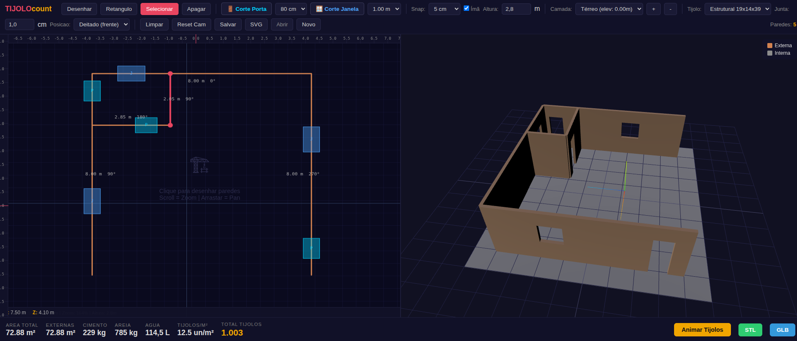

# TIJOLOcount — Calculadora 3D de Tijolos

Aplicacao web em Flask que calcula a quantidade de tijolos e materiais necessarios para uma construcao e gera um modelo 3D interativo das paredes usando **Trimesh** + **Three.js**.



## Funcionalidades

- Desenho interativo de paredes no canvas 2D com snap a grid (5 cm a 1 m)
- Suporte a multiplos andares/camadas com elevacao independente
- Cortes de portas e janelas nas paredes (com calculo automatico de area)
- 4 tipos de tijolo configuaveis + 3 orientacoes de assentamento (espelho, cutelo, deitado)
- Calculo automatico de argamassa, cimento, areia e agua (traco 1:3)
- Margem de perda de 10% automatica
- Modelo 3D gerado com **trimesh** (boolean operations via manifold3d) e exibido com **Three.js**
- Exportacao GLB (visualizacao) e STL (download)
- Viewer interativo: orbit controls (rotacionar, zoom, pan)
- Paredes externas (terracota), internas (cinza) e piso com cores distintas
- Animacao de tijolos posicionados nas paredes
- Reguas de medida no viewer 3D
- Salvar/Abrir projeto em JSON
- Arrastar extremidades das paredes para reposicionar (modo Selecionar)
- Snap magnetico a cantos e ponto medio de paredes (tecla M / checkbox "Ímã")
- Visualizacao de cortes (portas/janelas) no canvas 2D
- Visualizacao de camadas de referencia com cores translucidas
- Seletor de luz final na animacao (Nascer do Sol / Meio Dia / Por do Sol)
- Iluminacao balanceada com HemisphereLight no viewer 3D principal
- Meia-parede azul tracejada com altura/2 (botao dedicado + tecla H)
- Ctrl+Z desfazer (50 acoes: desenhar, apagar, mover, mudar tipo)
- Shift+Click multi-selecao de paredes (mover/apagar/alternar tipo em lote)
- Botoes de zoom +/- no canvas 2D (zoom-to-cursor)
- Tijolos cortados no final da parede na animacao (sem gaps nem protrusao)
- Selecao, movimentacao e delecao de portas/janelas no canvas 2D
- Botao Espelhar (toggle) para inverter o layout no viewer 3D (apenas eixo X)
- Divisao automatica de paredes nos cruzamentos ao desenhar
- Raio adaptativo do handle conforme zoom + zoom maximo 500%
- Fontes maiores (13px) para labels de parede

## Tecnologias

| Camada             | Tecnologia                    |
| ------------------ | ----------------------------- |
| Backend            | Flask (Python)                |
| Calculo 3D / Mesh  | Trimesh + manifold3d          |
| Frontend 3D        | Three.js (ES modules via CDN) |
| Canvas 2D          | Canvas API nativa             |
| Estilo             | CSS puro, tema escuro         |

## Como rodar

```bash
# 1. Clone o repositorio
git clone https://github.com/santocyber/TIJOLOcount.git
cd TIJOLOcount

# 2. Crie um ambiente virtual (recomendado)
python -m venv venv
source venv/bin/activate  # Linux/Mac
# venv\Scripts\activate   # Windows

# 3. Instale as dependencias
pip install -r requirements.txt

# 4. Inicie o servidor
python app.py
```

Acesse **http://localhost:5020**

> **Nota:** O diretorio `uploads/` e criado automaticamente ao iniciar com `python app.py`. Se usar outro servidor WSGI (ex: gunicorn), crie o diretorio manualmente.

## Como usar

1. Use o canvas 2D para **desenhar paredes** clicando para definir pontos (ferramenta "Desenhar" ativa por padrao)
2. Alternativamente, use a ferramenta **"Retangulo"** para criar 4 paredes de uma vez
3. Selecione paredes existentes com a ferramenta **"Selecionar"** para move-las, arrastar suas extremidades ou deleta-las
4. Adicione **portas e janelas** com os botoes de corte — clique sobre uma parede para posicionar
5. Configure a **altura** das paredes, **tipo de tijolo**, **junta de argamassa** e **posicao/orientacao** do tijolo na toolbar
6. Gerencie **camadas/andares** com os botoes `+` e `-` (cada camada tem paredes e altura independentes)
7. Clique em **"Gerar 3D"** para visualizar o modelo, areas e quantitativos de material
8. Use os botoes **Salvar** (JSON) e **Abrir** para persistir o projeto

## Tipos de Tijolo

| Chave                           | Nome               | Dimensoes (cm) |
| ------------------------------- | ------------------ | -------------- |
| `comum_19x9x9`                  | Tijolo Comum       | 19 x 9 x 9     |
| `bloco_estrutural_19x14x39`     | Bloco Estrutural   | 19 x 14 x 39   |
| `bloco_ceramico_9x14x24`        | Bloco Ceramico     | 9 x 14 x 24    |
| `tijolo_macico_21x10x5`         | Tijolo Macico      | 21 x 10 x 5    |

### Orientacao (posicao de assentamento)

| Orientacao | Descricao           | Dimensao ao longo da parede | Altura da fiada | Espessura da parede |
| ---------- | ------------------- | --------------------------- | --------------- | ------------------- |
| `espelho`  | De espelho (padrao) | largura                     | altura          | comprimento         |
| `cutelo`   | De cutelo (lado)    | largura                     | comprimento     | altura              |
| `deitado`  | Deitado (frente)    | comprimento                 | altura          | largura             |

A orientacao altera qual face do tijolo fica visivel na parede, modificando o calculo de tijolos/m² e a espessura final da parede.

## Formula de Calculo

```
Tijolos/m² = 1 / ((dimensao_ao_longo + junta) x (dimensao_vertical + junta))
Total = teto(area_total_paredes x tijolos/m² x 1.10)
```

As dimensoes `dimensao_ao_longo` e `dimensao_vertical` dependem da **orientacao** escolhida (ver tabela acima). A margem de 10% cobre quebras e recortes.

## Materiais (Argamassa)

O calculo de argamassa usa o volume ao redor de cada tijolo:

```
Volume_argamassa_por_tijolo = junta x (d_along + d_up + junta) x d_thick
Total_argamassa_kg = n_tijolos x volume_por_tijolo x 2000 kg/m³
```

A partir do volume total, o sistema calcula cimento, areia e agua usando traco 1:3 (alvenaria):

| Material       | Quantidade por m³ de argamassa |
| -------------- | ------------------------------ |
| Cimento        | 350 kg                         |
| Areia          | 1200 kg                        |
| Agua           | 175 L                          |

Os resultados (`cimento_kg`, `areia_kg`, `agua_l`) sao retornados na resposta JSON da API.

## Estrutura do Projeto

```
TIJOLOcount/
├── app.py                  # Servidor Flask (porta 5020)
├── requirements.txt        # Dependencias Python
├── .gitignore
├── src/
│   ├── calculator.py       # Logica de calculo de tijolos e materiais
│   ├── config.py           # Tipos de tijolo, orientacoes e constantes
│   ├── model_3d.py         # Geracao dos modelos .glb e .stl (trimesh)
│   └── __init__.py
├── templates/
│   └── index.html          # Interface web (toolbar + canvas + viewer)
├── static/
│   ├── style.css           # Estilos (tema escuro)
│   ├── app.js              # Viewer Three.js + gerenciamento de camadas
│   ├── animation.js        # Animacao de tijolos (BrickAnimator)
│   ├── cutout3d.js         # Corte de portas/janelas no 3D
│   ├── floorplan.js        # Canvas 2D para desenho de paredes
│   └── rulers.js           # Reguas de medida no viewer
└── uploads/                # Modelos .glb/.stl gerados (temporarios)
```

## Endpoints da API

| Rota                    | Metodo | Descricao                                 |
| ----------------------- | ------ | ----------------------------------------- |
| `/`                     | GET    | Interface principal                       |
| `/calculate`            | POST   | Calcula tijolos e gera .glb/.stl (JSON)   |
| `/model_glb/<filename>` | GET    | Serve arquivo .glb para visualizacao      |
| `/model_stl/<filename>` | GET    | Download do arquivo .stl (attachment)     |

### Exemplo de requisicao

```bash
curl -X POST http://localhost:5020/calculate \
  -H "Content-Type: application/json" \
  -d '{
    "layers": [
      {
        "name": "Térreo",
        "height": 2.80,
        "elevation": 0.0,
        "walls": [
          {
            "x1": 0, "z1": 0, "x2": 5, "z2": 0,
            "type": "external", "label": "Frente",
            "cutouts": [
              {
                "cut_type": "door",
                "width": 0.80,
                "height": 2.10,
                "position": 1.50,
                "elevation": 0.0
              },
              {
                "cut_type": "window",
                "width": 1.20,
                "height": 1.00,
                "position": 3.00,
                "elevation": 1.10
              }
            ]
          },
          {
            "x1": 0, "z1": 0, "x2": 0, "z2": 4,
            "type": "external", "label": "Lateral Esq."
          },
          {
            "x1": 0, "z1": 4, "x2": 5, "z2": 4,
            "type": "external", "label": "Fundo"
          },
          {
            "x1": 5, "z1": 0, "x2": 5, "z2": 4,
            "type": "external", "label": "Lateral Dir."
          }
        ]
      }
    ],
    "brick_type": "bloco_estrutural_19x14x39",
    "mortar_joint": 0.01,
    "orientation": "espelho"
  }'
```

> **Atencao:** O campo `mortar_joint` espera valor em **metros** na API (ex: `0.01` = 1 cm). No formulario web a conversao e feita automaticamente (cm → m).

### Exemplo de resposta (resumo)

```json
{
  "area_paredes_externas_m2": 44.8,
  "area_paredes_internas_m2": 0,
  "area_total_paredes_m2": 44.8,
  "tijolos_por_m2": 20.8,
  "total_tijolos": 1024,
  "espessura_parede_m": 0.14,
  "tipo_tijolo": "Bloco Estrutural (19x14x39 cm)",
  "posicao": "De espelho",
  "junta_argamassa_cm": 1.0,
  "total_argamassa_kg": 512.5,
  "cimento_kg": 89.7,
  "areia_kg": 307.5,
  "agua_l": 44.8,
  "glb_url": "/model_glb/walls_a1b2c3d4.glb",
  "stl_url": "/model_stl/walls_a1b2c3d4.stl",
  "paredes": [
    {
      "label": "Frente",
      "type": "external",
      "length_m": 5.0,
      "height_m": 2.8,
      "area_m2": 11.2,
      "cutouts": 2,
      "cut_area_m2": 2.88,
      "bricks": 233,
      "andar_elev": 0.0
    }
  ]
}
```

## Observacoes

- **Three.js via CDN:** O viewer 3D carrega Three.js por CDN (jsDelivr). E necessario conexao com internet para visualizar o modelo.
- **Modo debug:** O servidor roda com `debug=True` por padrao. Para producao, desabilite o debug e use um servidor WSGI (ex: gunicorn).
- **Modelos .glb/.stl:** Os arquivos 3D gerados ficam em `uploads/`. GLB e servido para visualizacao; STL e servido como download.
- **Boolean operations:** Cortes de portas/janelas no modelo 3D usam `manifold3d` (engine preferencial). Instale via `pip install manifold3d>=3.0` (ja incluso no `requirements.txt`).
- **Coordenadas:** As paredes sao definidas por pontos no plano XZ (chao). O eixo Y e a altura.

## Requisitos

- Python 3.8+
- Flask, Trimesh, NumPy, manifold3d
